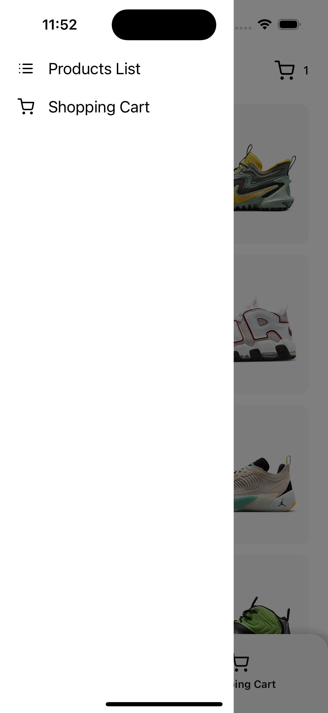
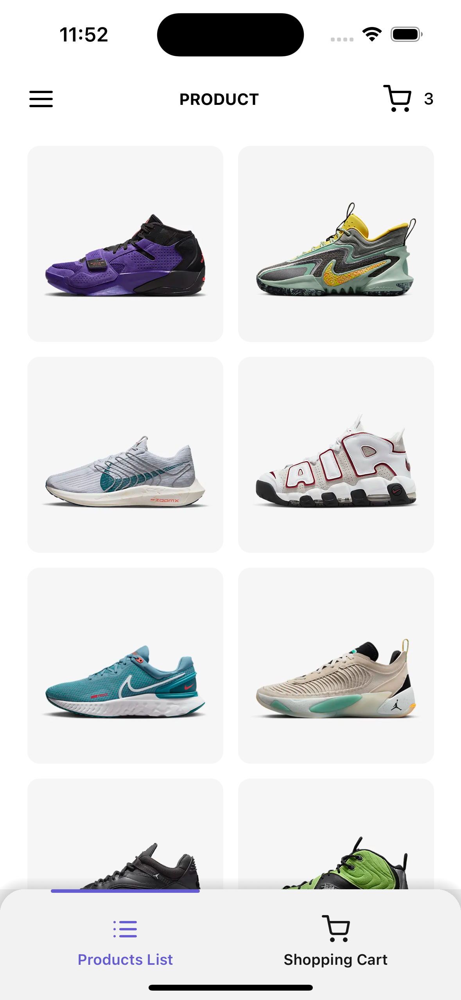
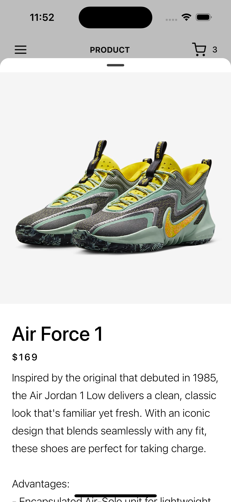
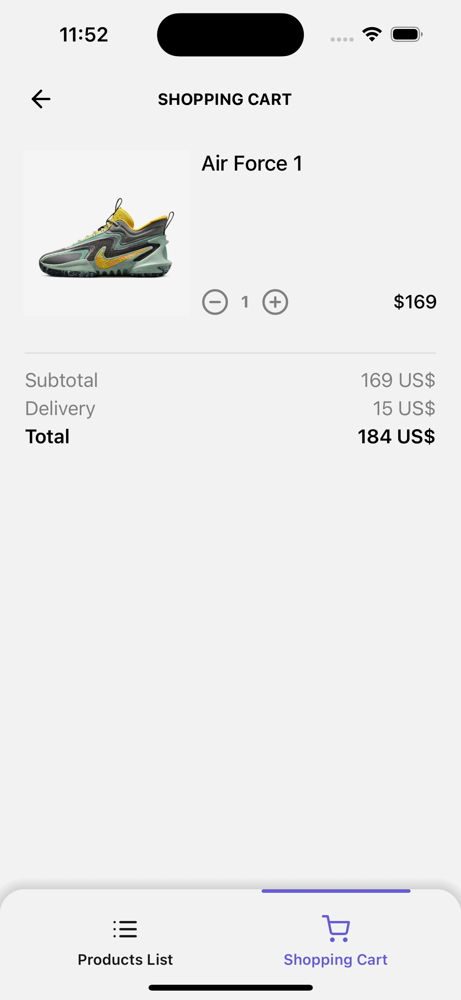

# 👟 Nike Shop (mobile app)

### A mobile application created using  `Expo`, `React Native`, `TypeScript`

### Store: `redux` and `reduxjs/toolkit`

### The application implements navigation using 
`react-native-navigation`

### Sidebar:

### Products List and Bottom-navbar:

### Product Detail used `@gorhom/bottom-sheet`

### Shopping cart. 
If we don't have any product in cart, 
on screen you can see empty component with button wich return 
user on to product screen. 

User can increase and decrease number of shoes or delete it from cart.
Implemented logic:
If total price > 200 delivery - 0$ if not - 15$.

### Functions which I used in app can be not understandable.

`size()`, `fontSize()` - Returns the value of the phone's pixel density, font scale and taking into account the screen width.
