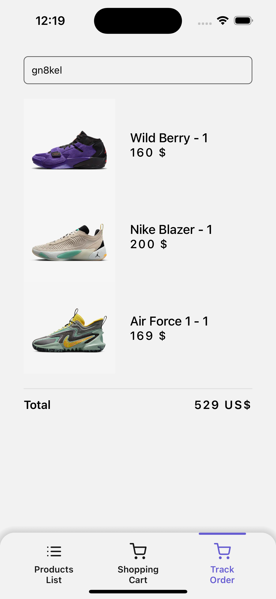

# 👟 Nike Shop (mobile app)

### A mobile application created using  `Expo`, `React Native`, `TypeScript`

### For created BackEnd I used `Express`, `Mongodb` you can check BE in different branch `backend-nikeApp`
#### for implement BE to FE I used the hooks that were created for us by the library `@reduxjs/toolkit/query/react`

### Store: `redux` and `reduxjs/toolkit`

### The application implements navigation using 
`react-native-navigation`

### Sidebar:

### Products List and Bottom-navbar:

### Product Detail used `@gorhom/bottom-sheet`

### Shopping cart. 
If we don't have any product in cart, 
on screen you can see empty component with button wich return 
user on to product screen. 

User can increase and decrease number of shoes or delete it from cart.
Implemented logic:
If total price > 200 delivery - 0$ if not - 15$.

### Track Order
After we create order user can check this order to "Track Order screen",
user can write reference in input and BE return this order.

BE return reference after success order

### Functions which I used in app can be not understandable.

`size()`, `fontSize()` - Returns the value of the phone's pixel density, font scale and taking into account the screen width.
